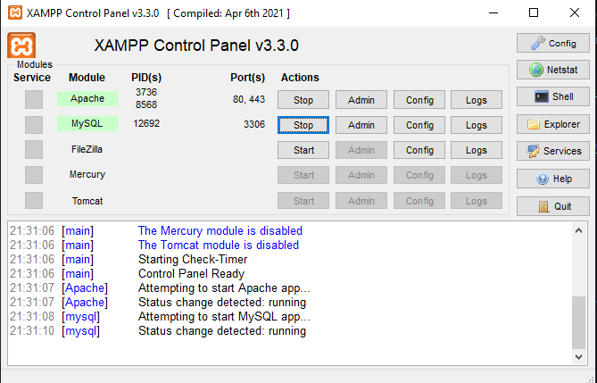

# Protótipo do Painel do Empreendedor
O protótipo do painel pode ser acessado a partir [deste link](https://painel-empreendedor-p-44075028dd80.herokuapp.com/), e é alimentado por [esta API de teste](https://www.npoint.io/docs/c9b78481158fd7622b0e). 

## Como abrir localmente
**É necessário ter o [XAMPP](https://www.apachefriends.org/pt_br/download.html) instalado.**

Ao instalar o XAMPP, ele criará uma pasta chamada *htdocs* (exemplo: C:\xampp\htdocs). Clone este repositório *dentro desta pasta*.

```
git clone https://github.com/Painel-Aderes/painel-empreendedor.git
```

Em seguida, abra o painel de controle do XAMPP e dê start no Apache e MySQL. 



Os projetos dentro do XAMPP são acessados através do endereço */localhost/nome-do-projeto* no navegador. Neste caso, o protótipo pode ser acessado através do endereço */localhost/painel-empreendedor*